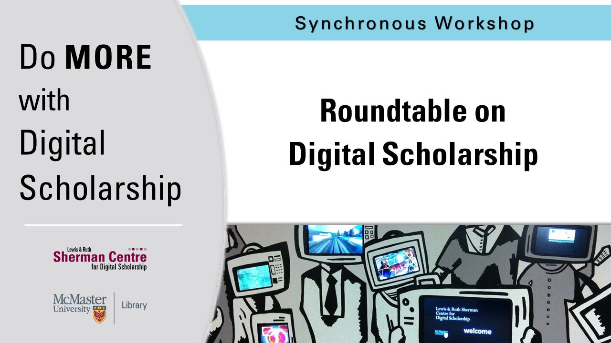

# Introduction to Digitization

What is digital scholarship, how can I do more with it, and how can it contribute to my research and teaching? Join some of McMaster’s emerging scholars in conversation as they reflect on their experiences in digital scholarship.

## Facilitator Bios

Helen Beny is a PhD student in the department of Political Science. Her research focuses on the impact of targeted Internet Blackouts against ethnic minority communities in Ethiopia and Cameroon. Her study draws insights from digital authoritarianism, information and communication technology development studies on Sub-Saharan Africa and global internet governance. She is interested in studying this growing phenomenon to expand theories of digital authoritarianism in an understudied region.

Raquel Burgess is a 2nd year PhD student in the Deptartment of Social & Behavioral Sciences at Yale School of Public Health. Her past degrees were in Global Health and Kinesiology at McMaster. Her research interests lie in health communication, access to health information in low-income communities, geographic determinants of access to information, and the role of non-public health actors in influencing public health messages. She is also interested in public health innovation and entrepreneurship. 

Adrianna Michell is a Masters student in Cultural Studies and Critical Theory program in the department of English and Cultural Studies. Her SSHRC-funded major research project considers the implications for labour during health crises through digital media. Her research interests also include critical disabilities studies and ecocriticism. She also completed her undergraduate degree at McMaster in English and Peace Studies.

Amanda Montague is a Postdoctoral Fellow at the Lewis and Ruth Sherman Centre for Digital Scholarship. Her dissertation, Mobile Memories: Canadian Cultural Memory in the Digital Age, considered the impact of mobile technologies and locative media narratives on everyday experiences of memory and place. In her current research and teaching she continues to experiment with digital storytelling tools and methods to facilitate engagement both within the classroom and with communities outside the university. 

Emily Van Haren is a PhD candidate and teaching fellow in the department of English & Cultural Studies at McMaster, where she works at the intersection of critical food studies, digital media studies, and cultural theory. Her SSHRC-funded dissertation considers the creative work economies, neoliberal media practices, and auto/biographical and museological conventions of the food blog genre. More broadly, her research interests include digital identity work, ASMR, and visual culture.
 
Moderated by Andrea Zeffiro, Academic Director, Lewis & Ruth Sherman Centre for Digital Scholarship

## Workshop Recording

<iframe height="416" width="100%" allowfullscreen frameborder=0 src="https://echo360.ca/media/fa99dbe1-bc9e-481b-ab21-095f6a8206f9/public"></iframe>
[View original here.](https://echo360.ca/media/fa99dbe1-bc9e-481b-ab21-095f6a8206f9/public)