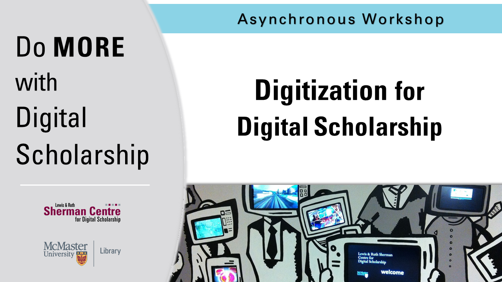

# Introduction to Digitization

Ever wondered how historical documents are digitized so they can form a corpus for digital scholarship? Join us for an Introduction to Digitization and learn about considerations for digitizing different kinds of materials, processing scans, storage, and sharing (and some ethical & practical implications along the way). “Digitization” is only step 1!

<!-- ## Facilitator Bio -->

<!-- Missing bio -->

## Workshop Recording

<iframe height="416" width="100%" allowfullscreen frameborder=0 src="https://echo360.ca/media/d3d03749-94da-4f3d-b46a-3cba681cc194/public"></iframe>
[View original here.](https://echo360.ca/media/d3d03749-94da-4f3d-b46a-3cba681cc194/public)
