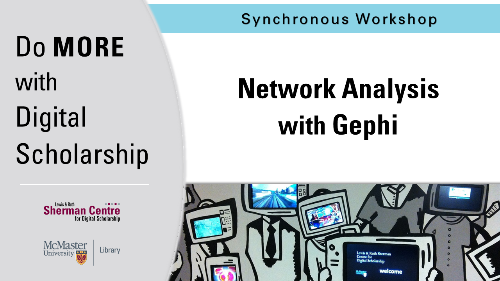

# Network Analysis with Gephi

Graph data, expressing relationships between entities, is another type of data that can be useful to visualize for scholars. We will use a visualization tool intended for social network analysis, [Gephi](https://gephi.org/), to map and identify relationships within a dataset scraped from Twitter.

**The recording and materials for this workshop are available here**: <https://learn.scds.ca/intro-gephi/>

## Facilitator Bio

Devon Mordell draws on her experience in media art, hobbyist programming and instructional design to teach workshops for the Sherman Centre. Her areas of interest in digital scholarship include data visualization, computational analyses of texts, sonification and critical digital humanities. Her research practice explores the algorithmic culture industry and platform psychogeography.