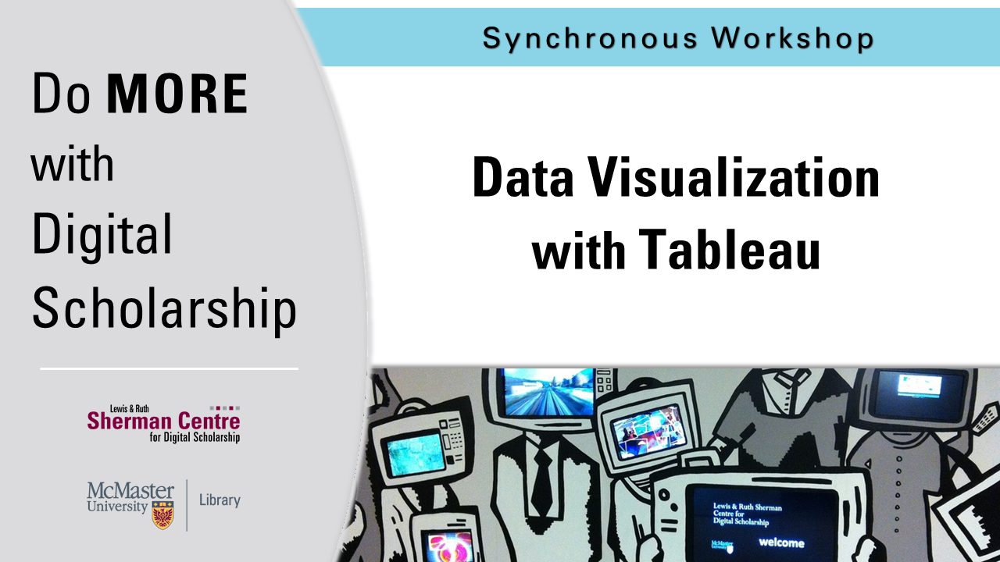

# Data Visualization with Tableau

You might not think of numbers and locations as Humanities data, but it all depends on how you use them! Working with numeric and spatial data, you will learn how to create visualizations in [Tableau](https://www.tableau.com/).

**The recording and materials for this workshop are available here**: <https://learn.scds.ca/intro-tableau/>

## Facilitator Bio

Devon Mordell draws on her experience in media art, hobbyist programming and instructional design to teach workshops for the Sherman Centre. Her areas of interest in digital scholarship include data visualization, computational analyses of texts, sonification and critical digital humanities. Her research practice explores the algorithmic culture industry and platform psychogeography.