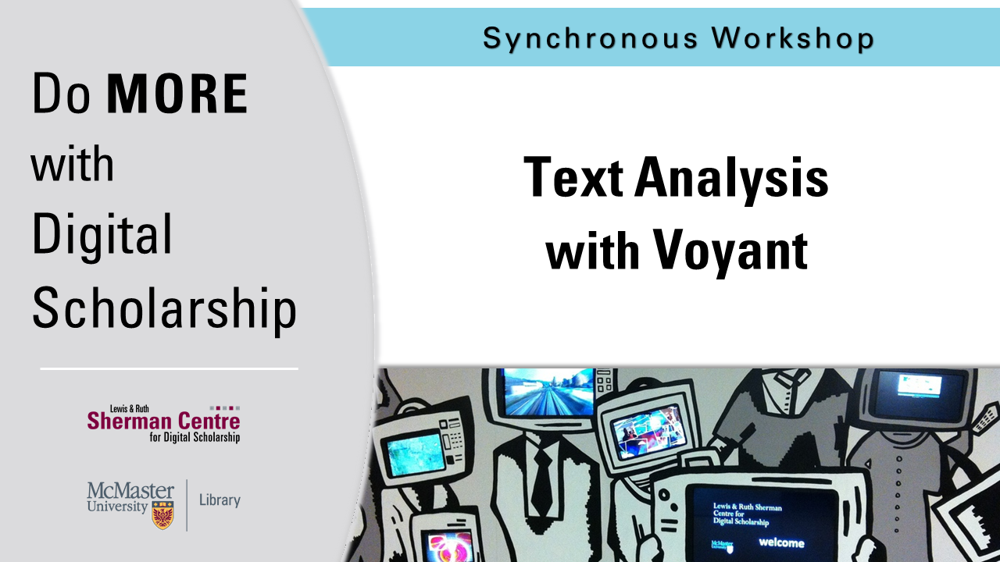

# Textual Analysis with Voyant

Written documents can be transformed into data for visualization, helping Humanities scholars see texts in different ways. We will use the web-based application Voyant Tools to analyze and visualize the text content of documents.

**The recording and materials for this workshop are available here**: <https://learn.scds.ca/intro-voyant/>

## Facilitator Bio

Devon Mordell draws on her experience in media art, hobbyist programming and instructional design to teach workshops for the Sherman Centre. Her areas of interest in digital scholarship include data visualization, computational analyses of texts, sonification and critical digital humanities. Her research practice explores the algorithmic culture industry and platform psychogeography.