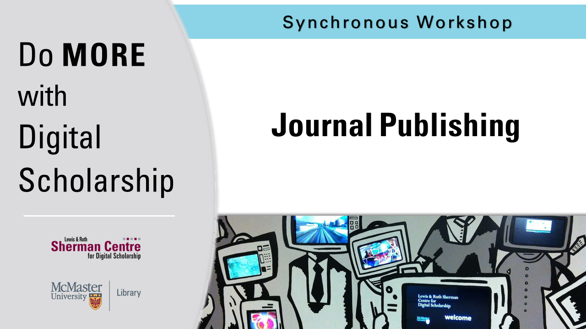

# Journal Publishing

In this workshop, attendees will get a chance to develop their knowledge of the range of workflows supported by the Open Journal Systems (OJS) open-source publishing software. The workshop will showcase the “behind the scenes” aspects of an academic journal and guide attendees through the significant steps of starting and editing a journal. No previous knowledge of journal publishing is required.

<!-- ## Facilitator Bio -->

<!-- Missing bio -->

## Workshop Recording

<iframe height="416" width="100%" allowfullscreen frameborder=0 src="https://echo360.ca/media/bed5b080-65ab-431a-82b9-ab46d4d0e900/public"></iframe>
[View original here.](https://echo360.ca/media/bed5b080-65ab-431a-82b9-ab46d4d0e900/public)
