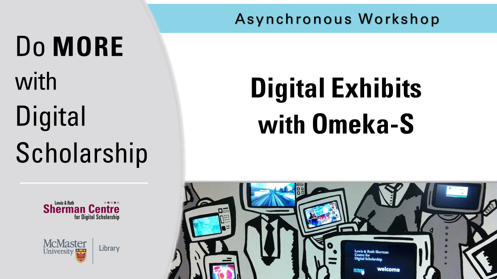

# Introduction to Digital Exhibits with Omeka-S

In this workshop, participants will learn how to use Omeka S to manage digital collections and create scholarly exhibits. The workshop will introduce users to the basic functions of Omeka S including how to create an archival item collection, add metadata, and build a digital exhibit. The potential benefits of using Omeka S in research and teaching will also be discussed.

**The recording and materials for this workshop are available here**: <https://learn.scds.ca/Omeka-S/>

<!-- ## Facilitator Bio -->

<!-- Bio missing -->