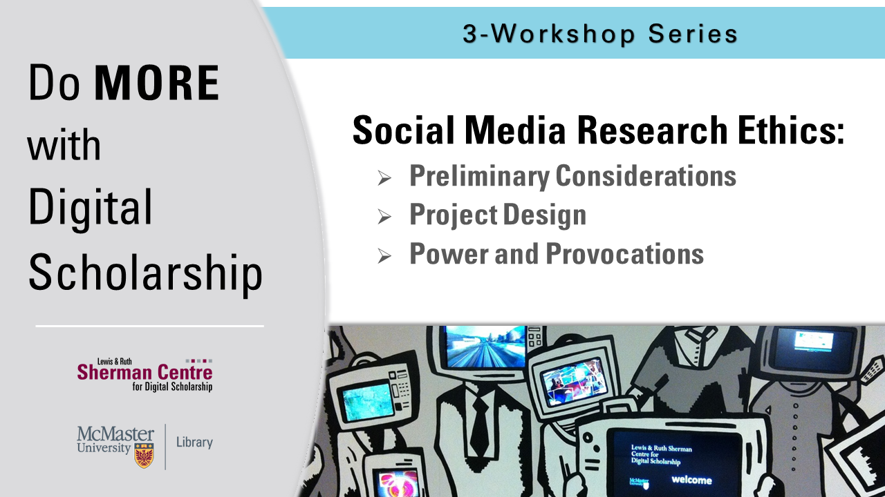

# Social Media Research Ethics

As researchers across disciplines incorporate social media platforms and data into their research, questions surrounding the ethical complexities of such research continue to proliferate. This trio of modules—-part of the Sherman Centre’s 2020-2021 Do More with Digital Scholarship workshop series—-identifies and explores some of the key methodologies, recurring ethical challenges, and embedded power dynamics of social media research.

Rather than offering a unified program or checklist approach to social media research ethics, these modules will help participants to enact ethical decision-making throughout the research process (including project design, choice of methods, data management and stewardship, and research presentation or dissemination) while also facilitating a trans-disciplinary and reflexive conversation about what it means to frame social media research in terms of ‘ethics.’

**The recording and materials for this workshop series are available here**: <https://learn.scds.ca/sm-research-ethics/>
